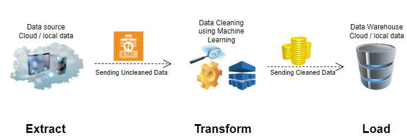
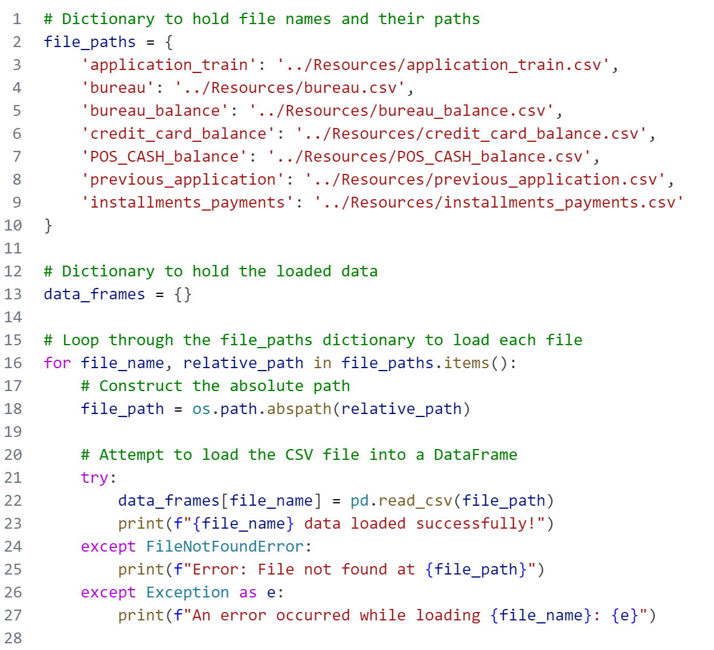

# Home Credit Default Risk Categorical Data Cleanining Using Machine Learning. 

## Project Summary
The purpose of the project is to make accurate predictions for categorical data missing values using machine learning model. Accuracy of predictions also determined.
# Process Diagram

## Table of Contents
- [Extract](#extract)
- [Data Source](#data-source)
- [Data Sets](#data-sets)
- [Transform](#transform)
- [Data Cleaning](#data-cleaning)
  - [Data Loading](#data-loading)
  - [Data Segregation](#data-segregation)
  - [Data Processing](#data-processing)
  - [Data Prediction](#data-prediction)
-[Load](#load)
  - [Data Export](#data-export)
- [Results and Conclusions](#results-and-conclusions)
- [Dependencies](#dependencies)
- [Future Work](#future-work)
- [Acknowledgments](#acknowledgments)
- [Author](#author)
- [References](#references)

# Extract
This is the process of obtaining data from the source. 
## Data Source
In this project data is obtained from Home credit default risk at Kaggle.com 
## Data Sets
Provided data has seven tables that are used in the project for cleaning and further analysis and machine learning models for prediction various features.
Provided data is in csv forms. Since data size is too big. it is not uploaded into github. it can be downloaded from kaggle directly.
- [Application Train]
- [Bureau]
- [Bureau Balance]
- [Previous Application]
- [Credit Card Balance]
- [Installments payments]
- [POS CASH Balance]

# Transform
Transformation is the process where data is renamed, adjusted or manipulated in a way to give missing data fields either meaningful data or removing the empty fields from dataset.In this project our aim is study the process where we lose minimal data and fill empty data fields by using Machine learning models especially categorial data. Commonly transformation process is refered to as cleaning data as well so we will dig deeper into cleaning process.

## Data Cleaning
The process of data cleaning is divided into three stages below as per techniquie followed to better understand segregate , process the numerial data and then make the predictions for categorical data and put the predicted values into missing fields.

### Data Loading


### Data Segregation

### Data Processing

### Data Prediction

# Load

### Data Export


## Results and Conclusions


  
## Dependencies

This project involves using various dependences listed below for data cleaning and predictions.

```bash
import pandas as pd
import os
import matplotlib.pyplot as plt
import seaborn as sns
from sklearn.ensemble import RandomForestClassifier
from sklearn.model_selection import train_test_split
from sklearn.preprocessing import LabelEncoder, OneHotEncoder
from sklearn.compose import ColumnTransformer
from sklearn.pipeline import Pipeline
from sklearn.impute import SimpleImputer
from sklearn.metrics import accuracy_score

```

## How to Run


## Future Work
Data cleaning is very important aspect for performing analysis and making predictions. If data is not cleaned properly our models can make wrong prediction and vital relations can not be understood.

## Acknowledgments
I would like to thank Home credit for providing Data set on Kaggle.com for analysis.
draw.io for generating Process diagram.
Lovepreet singh, Audrey Nkrumah and Vinay for data search during class project.

## Author

Muhammad Kashif 

## References
[1] [Home Credit Default Risk](https://www.kaggle.com/c/home-credit-default-risk/data)
