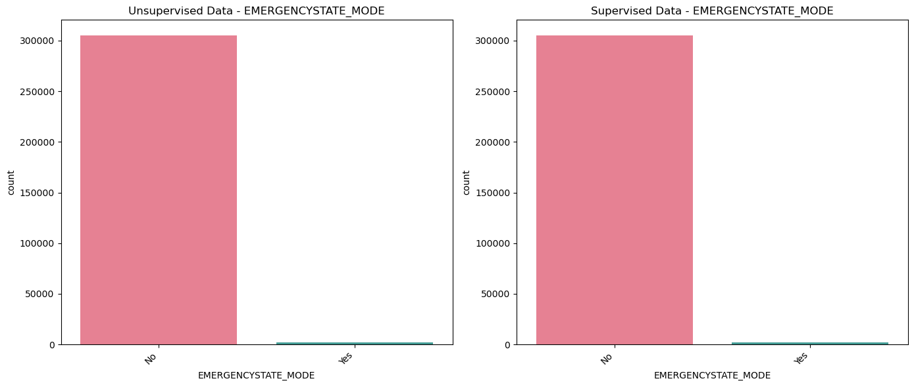
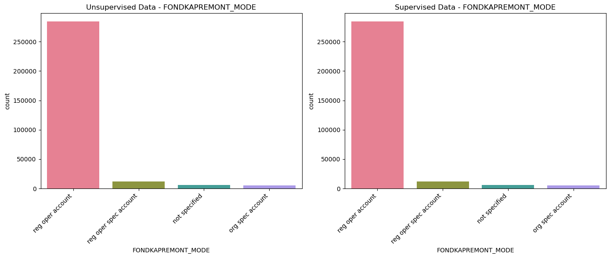
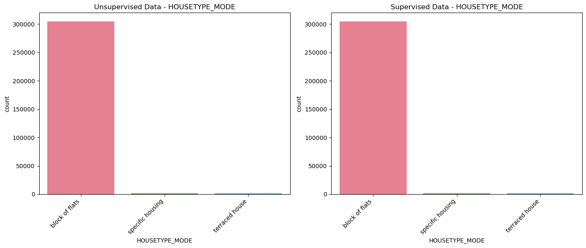
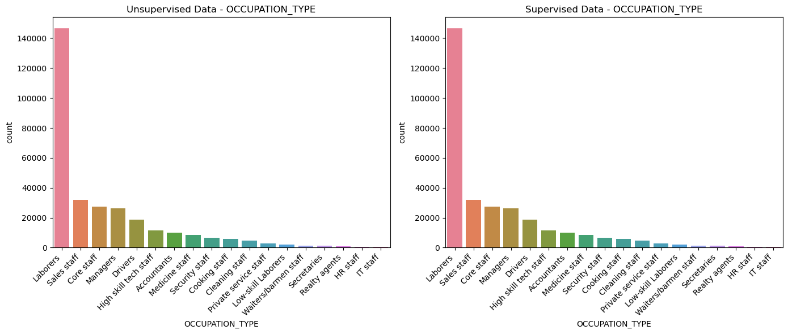
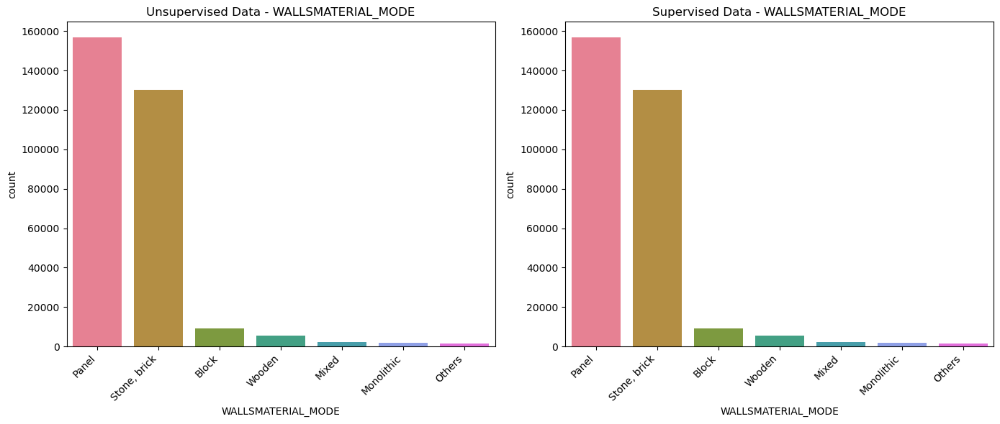

# Home Credit Default Risk Categorical Data Cleanining Using Machine Learning. 

## Project Summary
The purpose of the project is to make accurate predictions for categorical data missing values using machine learning model. Data is analysed by segregating data by their types. After careful review of each column, Numerical and Categorical data.Prediction is made using Machine Learning model RandomForestClassifier and Accuracy of predictions for each column is determined as well. In the second method, application_train table is cleaned using Un-supervised learning model.The results are compared in the form of bar charts to visualize and determine the difference. The start and end time of cleaning process is also calculated, which gave interesting insight into economical model to be used for predicting categorical data.
Before the begining of cleaning process numerical values were filled with 0. Since data table contains empty values for columns which states (Supporting or external) Documents provided by applicant so we assume no document is provided. although it leads to skewness of data but sake of modelling missing values in this regards is considered as no information provided.  

# Process Diagram
This diagram shows data is obtained from source, preprocessed, cleaned and predictions are made and then data is stored into datawarehouse.  

## Table of Contents
- [Extract](#extract)
  - [Data Source](#data-source)
  - [Data Sets](#data-sets)
- [Transform](#transform)
  - [Data Cleaning](#data-cleaning)
  - [Data Loading](#data-loading)
  - [Data Segregation](#data-segregation)
  - [Data Processing](#data-processing)
  - [Data Prediction](#data-prediction)
      - [Supervised Learning](#supervised-learning)
      - [UnSupervised Learning](#unsupervised-learning)   
  - [Models Comparison](#models-comparison)  
- [Load](#load)
  - [Data Export](#data-export)
- [Results and Conclusions](#results-and-conclusions)
- [Dependencies](#dependencies)
- [Future Work](#future-work)
- [Acknowledgments](#acknowledgments)
- [Author](#author)
- [References](#references)

# Extract
The process of obtaining data from the source. 
## Data Source
In this project data is obtained from Home credit default risk at Kaggle.com 
## Data Sets
Provided data has seven tables that are used in the project for cleaning and further analysis and machine learning models for prediction various features.
Provided data is in csv forms. Since data size is too big. it is not uploaded into github. it can be downloaded from kaggle directly.
- [Application Train]
- [Bureau]
- [Bureau Balance]
- [Previous Application]
- [Credit Card Balance]
- [Installments payments]
- [POS CASH Balance]

# Transform
Transformation is the process where data is renamed, adjusted or manipulated in a way to give missing data fields either meaningful data or removing the empty fields from dataset.In this project our aim is study the process where we lose minimal data and fill empty data fields by using Machine learning models especially categorial data. Commonly transformation process is refered to as cleaning data as well so we will dig deeper into cleaning process.

## Data Cleaning
The process of data cleaning is divided into three stages below as per techniquie followed to better understand segregate , process the numerial data and then make the predictions for categorical data and put the predicted values into missing fields.

### Data Loading
Data is loaded from csv files in this project using absolute path method. since Data files are big size which can not be accomodated in the github. so for sake of project they were kept in different folder to avoid large size file errors during commit stage. Code for loading data using absolute path is below.

``` bash
# Dictionary to hold file names and their paths
file_paths = {
    'application_train': '../Resources/application_train.csv',
    'bureau': '../Resources/bureau.csv',
    'bureau_balance': '../Resources/bureau_balance.csv',
    'credit_card_balance': '../Resources/credit_card_balance.csv',
    'POS_CASH_balance': '../Resources/POS_CASH_balance.csv',
    'previous_application': '../Resources/previous_application.csv',
    'installments_payments': '../Resources/installments_payments.csv'
}

# Dictionary to hold the loaded data
data_frames = {}

# Loop through the file_paths dictionary to load each file
for file_name, relative_path in file_paths.items():
    # Construct the absolute path
    file_path = os.path.abspath(relative_path)
    
    # Attempt to load the CSV file into a DataFrame
    try:
        data_frames[file_name] = pd.read_csv(file_path)
        print(f"{file_name} data loaded successfully!")
    except FileNotFoundError:
        print(f"Error: File not found at {file_path}")
    except Exception as e:
        print(f"An error occurred while loading {file_name}: {e}")

```
The data is present is dictionary  data_frames each data set can be accessed using code below. 

``` bash
# view application_train data
application_train_df = data_frames['application_train']
application_train_df
```
after data is loaded in dataframe, duplicate SK_ID_CURR values are dropped and in the respective tables duplicates are dropped as described in segregation section.
### Data Segregation
After accessing data. Data is segregated by data type e.g Numerical and Categorical Data. This will help to better understand data and treat each column with care so each column can be filled with right values. In this project our focus is to use categorical data for cleaning and predicting values using Machine Learning models. In this project, SK_ID_CURR is considered unique ID for table application_train, previous_application and bureau, while SK_ID_BUREAU is taken as unqiue in the Table bureau_balance. SK_ID_PREV is taken as unique ID in tables POS_CASH_balance, installments_payments and credit_card_balance.
This unique ID consideration is taken as measure to clean data and then merge different tables.
code for segregating categorical data and numerical data is shown below.

``` bash
# Separate SK_ID_CURR along with numerical columns
numerical_and_id = application_train_df.select_dtypes(include=['number']).copy()

# Include SK_ID_CURR in numerical set
numerical_and_id['SK_ID_CURR'] = application_train_df['SK_ID_CURR']

# Separate SK_ID_CURR along with categorical columns
categorical_and_id = application_train_df.select_dtypes(include=['object', 'category']).copy()

# Include SK_ID_CURR in categorical set
categorical_and_id['SK_ID_CURR'] = application_train_df['SK_ID_CURR']

# Print the selected numerical data
print("SK_ID_CURR along with Numerical Columns:")
print(numerical_and_id)

# print selected categorical data
print("\nSK_ID_CURR along with Categorical Columns:")
print(categorical_and_id)

```

### Data Processing
Data processing or preprocessing is done by performing values count of each column values and then each column is studied to determine how it is going to be dealt. In this project, Numerical values are filled by 0 values and only Target column is not filled with 0 values.
This will prevent misleading results when preforming Machine Learning models. Home credit data when obtained after dropping duplicate values provide us with Target columns without any missing values. So we do not futher processing for this particular dataset.
code for value counts to determine NaN values is below:

``` bash
# Inspect NaN values in categorical columns
# Loop through each categorical column
for column in categorical_and_id.columns:
    # Skip SK_ID_CURR
    if column == 'SK_ID_CURR':
        continue
    # Print value counts for the current column
    print(categorical_and_id[column].value_counts(dropna=False))
```
output cells of above code are below
``` bash
NAME_CONTRACT_TYPE
Cash loans         278232
Revolving loans     29279
Name: count, dtype: int64
CODE_GENDER
F      202448
M      105059
XNA         4
Name: count, dtype: int64
FLAG_OWN_CAR
N    202924
Y    104587
Name: count, dtype: int64
FLAG_OWN_REALTY
Y    213312
N     94199
Name: count, dtype: int64
NAME_TYPE_SUITE
Unaccompanied      248526
Family              40149
Spouse, partner     11370
Children             3267
Other_B              1770
NaN                  1292
Other_A               866
Group of people       271
Name: count, dtype: int64
NAME_INCOME_TYPE
Working                 158774
Commercial associate     71617
Pensioner                55362
State servant            21703
Unemployed                  22
Student                     18
Businessman                 10
Maternity leave              5
Name: count, dtype: int64
NAME_EDUCATION_TYPE
Secondary / secondary special    218391
Higher education                  74863
Incomplete higher                 10277
Lower secondary                    3816
Academic degree                     164
Name: count, dtype: int64
NAME_FAMILY_STATUS
Married                 196432
Single / not married     45444
Civil marriage           29775
Separated                19770
Widow                    16088
Unknown                      2
Name: count, dtype: int64
NAME_HOUSING_TYPE
House / apartment      272868
With parents            14840
Municipal apartment     11183
Rented apartment         4881
Office apartment         2617
Co-op apartment          1122
Name: count, dtype: int64
OCCUPATION_TYPE
NaN                      96391
Laborers                 55186
Sales staff              32102
Core staff               27570
Managers                 21371
Drivers                  18603
High skill tech staff    11380
Accountants               9813
Medicine staff            8537
Security staff            6721
Cooking staff             5946
Cleaning staff            4653
Private service staff     2652
Low-skill Laborers        2093
Waiters/barmen staff      1348
Secretaries               1305
Realty agents              751
HR staff                   563
IT staff                   526
Name: count, dtype: int64
WEEKDAY_APPR_PROCESS_START
TUESDAY      53901
WEDNESDAY    51934
MONDAY       50714
THURSDAY     50591
FRIDAY       50338
SATURDAY     33852
SUNDAY       16181
Name: count, dtype: int64
ORGANIZATION_TYPE
Business Entity Type 3    67992
XNA                       55374
Self-employed             38412
Other                     16683
Medicine                  11193
Business Entity Type 2    10553
Government                10404
School                     8893
Trade: type 7              7831
Kindergarten               6880
Construction               6721
Business Entity Type 1     5984
Transport: type 4          5398
Trade: type 3              3492
Industry: type 9           3368
Industry: type 3           3278
Security                   3247
Housing                    2958
Industry: type 11          2704
Military                   2634
Bank                       2507
Agriculture                2454
Police                     2341
Transport: type 2          2204
Postal                     2157
Security Ministries        1974
Trade: type 2              1900
Restaurant                 1811
Services                   1575
University                 1327
Industry: type 7           1307
Transport: type 3          1187
Industry: type 1           1039
Hotel                       966
Electricity                 950
Industry: type 4            877
Trade: type 6               631
Industry: type 5            599
Insurance                   597
Telecom                     577
Emergency                   560
Industry: type 2            458
Advertising                 429
Realtor                     396
Culture                     379
Industry: type 12           369
Trade: type 1               348
Mobile                      317
Legal Services              305
Cleaning                    260
Transport: type 1           201
Industry: type 6            112
Industry: type 10           109
Religion                     85
Industry: type 13            67
Trade: type 4                64
Trade: type 5                49
Industry: type 8             24
Name: count, dtype: int64
FONDKAPREMONT_MODE
NaN                      210295
reg oper account          73830
reg oper spec account     12080
not specified              5687
org spec account           5619
Name: count, dtype: int64
HOUSETYPE_MODE
NaN                 154297
block of flats      150503
specific housing      1499
terraced house        1212
Name: count, dtype: int64
WALLSMATERIAL_MODE
NaN             156341
Panel            66040
Stone, brick     64815
Block             9253
Wooden            5362
Mixed             2296
Monolithic        1779
Others            1625
Name: count, dtype: int64
EMERGENCYSTATE_MODE
No     159428
NaN    145755
Yes      2328
Name: count, dtype: int64

```
Before going into prediction phase, numerical data is filled with values and merged based on column SK_ID_CURR.
Then merged data is used to predict categorical values. In this project any table which does not have missing categorical values, numerical data is filled with 0 values except Target column. output csv file is saved for later use.

### Data Prediction  
#### Supervised Learning  
Supervised learning is a type of machine learning where the algorithm learns from labeled data, which means each input data point is paired with a corresponding target label or output.  
The goal of supervised learning is to learn a mapping from inputs to outputs, based on the provided labeled examples, in such a way that the model can generalize to unseen data and  
accurately predict the correct output for new inputs.  
Below are the steps taken to run the supervised learning model for the prediction of categorcial data.
  
Merged table is used for prediction of categorical data. Prediction is made using RandomForestClassifier.  
In the first step, missing values in the categorical values are identified.  
A copy of the original dataframe is created to maintain its integrity.  
A dictionary is initialized to store values of accuracy score of each column.  
Each categorical column is iterated over to seperate out missing values.  
A boolean mask is created to identify missing values in the current column.  
Data is splitted into known and unknown samples: Known samples are those with non-missing values, while unknown samples are those with missing values.  
The target column (the one with missing values) is dropped from known samples to separate features (X) and target (y).  
This step involves setting up transformers to handle missing values and encode categorical features.  
A pipeline is created that preprocesses the data and then fits a RandomForestClassifier to predict missing categorical values.  
Using the trained classifier, missing values in the current column are predicted for unknown samples.  
The missing values in the original DataFrame are replaced with the predicted values.  
The accuracy score of the classifier for predicting missing values in the current column is calculated and stored.  
This step checks if there are still any NaN values remaining in the DataFrame after imputation.  
Finally,the total number of missing values in the DataFrame after all missing values have been filled is printed.  
Time taken to complete the process is also calculated to determine the economy of the model.

#### Pipeline
It simplifies the code by encapsulating multiple processing steps into a single object.This makes the code more readable, modular, and easier to maintain.A Pipeline helps ensure reproducibility by encapsulating the entire process, including preprocessing and modeling, in one entity.It ensures that the steps are executed in the correct order, which is crucial for preprocessing and model training.

#### Masking
Masking is used to separate the data into two sets: one with known values and another with missing values in the target column.
This separation is crucial for training a machine learning model. Known samples are used for training, and the model is then used to predict the missing values in the unknown samples.

``` bash
# Record the start time
start_time = time.time()
time.sleep(2)  # This makes the program wait for 2 seconds
# Identify columns with missing categorical values
categorical_columns_with_missing = merge_data.select_dtypes(include='object').columns[merge_data.select_dtypes(include='object').isnull().any()]

# Create a copy of the DataFrame
df_filled = merge_data.copy()

# Initialize a dictionary to store accuracy scores for each column
accuracy_scores = {}

# Iterate over each column with missing categorical values
for col in categorical_columns_with_missing:
    print(f"Filling missing values for {col}")

    # Create a mask for missing values
    missing_mask = df_filled[col].isnull()

    # Split the data into known and unknown samples
    known_samples = df_filled[~missing_mask]
    unknown_samples = df_filled[missing_mask]

    # Drop the target column from known samples
    X_known = known_samples.drop(columns=[col])
    y_known = known_samples[col]

    # Create a preprocessor for numerical and categorical columns
    numerical_features = X_known.select_dtypes(include=['int64', 'float64']).columns
    categorical_features = X_known.select_dtypes(include='object').columns

    numerical_transformer = SimpleImputer(strategy='mean')
    categorical_transformer = Pipeline(steps=[
        ('imputer', SimpleImputer(strategy='most_frequent')),
        ('onehot', OneHotEncoder(handle_unknown='ignore'))
    ])

    preprocessor = ColumnTransformer(
        transformers=[
            ('num', numerical_transformer, numerical_features),
            ('cat', categorical_transformer, categorical_features)
        ])

    # Create and fit the classifier
    clf = Pipeline(steps=[('preprocessor', preprocessor),
                           ('classifier', RandomForestClassifier(n_estimators=100, random_state=42))])

    clf.fit(X_known, y_known)

    # Predict missing values for unknown samples
    X_unknown = unknown_samples.drop(columns=[col])
    y_unknown_predicted = clf.predict(X_unknown)

    # Fill missing values in the original DataFrame
    df_filled.loc[missing_mask, col] = y_unknown_predicted

    # Calculate accuracy score
    accuracy = accuracy_score(known_samples[col], clf.predict(X_known))
    accuracy_scores[col] = accuracy

    print(f"Filled {sum(missing_mask)} missing values for {col} with accuracy: {accuracy:.4f}")

    # Check if there are still NaN values after imputation
    nan_columns = df_filled.columns[df_filled.isnull().any()]
    if nan_columns.any():
        print(f"NaN values still present after imputation in columns: {nan_columns}")

# Ensure there are no missing values left
print("\nNumber of missing values after filling:", df_filled.isnull().sum().sum())
# Record the end time
end_time = time.time()

# Calculate the time taken
time_taken = end_time - start_time

# Convert to minutes and seconds
minutes = int(time_taken // 60)
seconds = int(time_taken % 60)

print(f"Time taken to run the code: {minutes} minutes and {seconds} seconds")
```
Below are output results after prediction is made for categorical values.

```
Filling missing values for NAME_TYPE_SUITE
Filled 1292 missing values for NAME_TYPE_SUITE with accuracy: 1.0000
NaN values still present after imputation in columns: Index(['OCCUPATION_TYPE', 'FONDKAPREMONT_MODE', 'HOUSETYPE_MODE',
       'WALLSMATERIAL_MODE', 'EMERGENCYSTATE_MODE'],
      dtype='object')
Filling missing values for OCCUPATION_TYPE
Filled 96391 missing values for OCCUPATION_TYPE with accuracy: 1.0000
NaN values still present after imputation in columns: Index(['FONDKAPREMONT_MODE', 'HOUSETYPE_MODE', 'WALLSMATERIAL_MODE',
       'EMERGENCYSTATE_MODE'],
      dtype='object')
Filling missing values for FONDKAPREMONT_MODE
Filled 210295 missing values for FONDKAPREMONT_MODE with accuracy: 1.0000
NaN values still present after imputation in columns: Index(['HOUSETYPE_MODE', 'WALLSMATERIAL_MODE', 'EMERGENCYSTATE_MODE'], dtype='object')
Filling missing values for HOUSETYPE_MODE
Filled 154297 missing values for HOUSETYPE_MODE with accuracy: 1.0000
NaN values still present after imputation in columns: Index(['WALLSMATERIAL_MODE', 'EMERGENCYSTATE_MODE'], dtype='object')
Filling missing values for WALLSMATERIAL_MODE
Filled 156341 missing values for WALLSMATERIAL_MODE with accuracy: 1.0000
NaN values still present after imputation in columns: Index(['EMERGENCYSTATE_MODE'], dtype='object')
Filling missing values for EMERGENCYSTATE_MODE
Filled 145755 missing values for EMERGENCYSTATE_MODE with accuracy: 1.0000

Number of missing values after filling: 0
Time taken to run the code: 50 minutes and 26 seconds
```

#### UnSupervised Learning  
Unsupervised learning is a type of machine learning where the algorithm learns from unlabeled data, which means the input data is not paired with corresponding target labels or outputs. The goal of unsupervised learning is to find patterns, structures, or relationships in the input data without explicit guidance or supervision from labeled examples.  
Below is code snippet for unsupervised learning.  
``` bash
# Record the start time
start_time = time.time()

# Identify columns with missing values
categorical_columns_with_missing = application_train_df_unsupervised.select_dtypes(include='object').columns[application_train_df_unsupervised.select_dtypes(include='object').isnull().any()]
numerical_columns_with_missing = application_train_df_unsupervised.select_dtypes(include=['int64', 'float64']).columns[application_train_df_unsupervised.select_dtypes(include=['int64', 'float64']).isnull().any(axis=0)]

# Initialize n_clusters for KMeans
n_clusters = 5

# Create a copy of the DataFrame for preprocessing
df_filled_unsupervised = application_train_df_unsupervised.copy()

# Fill missing numerical values with 0
for col in numerical_columns_with_missing:
    df_filled_unsupervised[col] = df_filled_unsupervised[col].fillna(0)

# Prepare DataFrame for clustering (excluding categorical columns with missing values)
df_clustering = df_filled_unsupervised.drop(columns=categorical_columns_with_missing)

# Convert remaining categorical variables to dummy variables for clustering
df_clustering = pd.get_dummies(df_clustering, drop_first=True)

# Perform clustering
kmeans = KMeans(n_clusters=n_clusters, random_state=42)
df_clustering['cluster'] = kmeans.fit_predict(df_clustering)

# Add the cluster information back to the df_filled DataFrame
df_filled_unsupervised['cluster'] = df_clustering['cluster']

# Fill missing categorical values based on clusters
for col in categorical_columns_with_missing:
    print(f"Filling missing values for {col} using clustering-based approach")
    # Count the number of missing values before filling
    missing_before = df_filled_unsupervised[col].isnull().sum()

    # Loop over each cluster to fill missing values
    for cluster in range(n_clusters):
        cluster_df = df_filled_unsupervised.loc[df_filled_unsupervised['cluster'] == cluster, col]

        if not cluster_df.empty:
            mode_value = cluster_df.mode().iloc[0] if not cluster_df.mode().empty else df_filled_unsupervised[col].mode()[0] if df_filled_unsupervised[col].mode().size > 0 else "Missing"
            df_filled_unsupervised.loc[(df_filled_unsupervised['cluster'] == cluster) & (df_filled_unsupervised[col].isnull()), col] = mode_value

    # Count the number of missing values after filling and calculate the filled amount
    missing_after = df_filled_unsupervised[col].isnull().sum()
    total_filled = missing_before - missing_after
    print(f"Filled {total_filled} missing values for {col}")

# remove the cluster column 
df_filled_unsupervised.drop(columns=['cluster'], inplace=True)

# Verify no missing values are left
print("\nNumber of missing values after filling:", df_filled_unsupervised.isnull().sum().sum())

# Record the end time
end_time = time.time()

# Calculate the time taken
time_taken = end_time - start_time

# Convert to minutes and seconds
minutes = int(time_taken // 60)
seconds = int(time_taken % 60)

print(f"Time taken to run the code: {minutes} minutes and {seconds} seconds")

```
below are the results of unsupervised  
```
Filling missing values for NAME_TYPE_SUITE using clustering-based approach
Filled 1292 missing values for NAME_TYPE_SUITE
Filling missing values for OCCUPATION_TYPE using clustering-based approach
Filled 96391 missing values for OCCUPATION_TYPE
Filling missing values for FONDKAPREMONT_MODE using clustering-based approach
Filled 210295 missing values for FONDKAPREMONT_MODE
Filling missing values for HOUSETYPE_MODE using clustering-based approach
Filled 154297 missing values for HOUSETYPE_MODE
Filling missing values for WALLSMATERIAL_MODE using clustering-based approach
Filled 156341 missing values for WALLSMATERIAL_MODE
Filling missing values for EMERGENCYSTATE_MODE using clustering-based approach
Filled 145755 missing values for EMERGENCYSTATE_MODE

Number of missing values after filling: 0
Time taken to run the code: 1 minutes and 2 seconds

```

## Models Comparison
After running unsupervised and supervised models their results are compared and time taken for the process to complete is also determine 
which will helps determing the economic machine leaning model to use.It is very surprising that Unsupervised learning method using 
clusttering technique only took 1 minute and 2 seconds to predict the categorical data and output the filled dataframe. while supervised 
learning method took 50 minutes and 26 seconds. This is almost 50 folds time difference in time taken to predict the data between
unsupervised and supervised leanring using the same dataframe. It is also noted that predicted number of results are also same, that 
means clusttering and Randomforestclassifier made exactly same predictions which is evident by value counts of numbers after predictions
are made while their visalization prove the same point.  
Below is tabular data of results after cleaning by both models.  

| Column Name        | Supervised Results | UnSupervised Results |
| :----------------- | :----------------: | :-------------------:|
| OCCUPATION_TYPE    | 96391              | 96391                |
| FONDKAPREMONT_MODE | 210295             | 210295               |
| HOUSETYPE_MODE     | 154297             | 154297               |
| WALLSMATERIAL_MODE | 156341             | 156341               |
| EMERGENCYSTATE_MODE| 145755             | 145755               |

Below are graphs are only taken for those categorical columns which has null.  
  
  
  
  
  

# Load
In this phase, data is loaded into data warehouse.
### Data Export
In this project data after prediction is exported as csv file. or can be stored into database e.g postgresql.

## Results and Conclusions

Home credit default risk dataset contained large number of missing values in columns OCCUPATION_TYPE(null values = 96391), FONDKAPREMONT_MODE(null values = 210295), HOUSETYPE_MODE(null values = 154297),WALLSMATERIAL_MODE(null values = 156341), EMERGENCYSTATE_MODE(null values = 145755) of categorical data which result in siginificant loss of data if NaN values are dopped directly.Application_train table has more than 300,000. rows which after perform dropna is left with almost 8000 rows. This massive data loss is not acceptable. By employing Machine learning model, there was not a data loss of a single row. In this project, supervised and unsupervised methods are used and their economy is also determined. Unsupervised Machine learning method predicted the same categorical data in 1 minute and 2 seconds while Supervised machine learning model using RandomForestClassifier took 50 minutes and 26 seconds. So Machine learning has helped greatly to predict categorical with accuracy score of 1.00 as evident from above result. The graphical visualization shows that both models predicted data with accuracy and and output gave same number of values. In the code file'home_credit_data_cleaning.ipynb' all tables were cleaned and saved.

  
## Dependencies

This project involves using various dependences listed below for data cleaning and predictions.

```bash
import pandas as pd
import os
import matplotlib.pyplot as plt
import seaborn as sns
from sklearn.ensemble import RandomForestClassifier
from sklearn.model_selection import train_test_split
from sklearn.preprocessing import LabelEncoder, OneHotEncoder
from sklearn.compose import ColumnTransformer
from sklearn.pipeline import Pipeline
from sklearn.impute import SimpleImputer
from sklearn.metrics import accuracy_score

```
## Future Work
Data cleaning is very important aspect for performing analysis and making predictions. If data is not cleaned properly our models can make wrong prediction and vital relations can not be understood. In this project particular assumptions were made e.g. filling numerical data with 0 values. although numericals data can predicted but they are beyond the scope and economy of the project.  

## Acknowledgments
I would like to thank Home credit for providing Data set on Kaggle.com for analysis.
draw.io for generating Process diagram.
Lovepreet singh, Audrey Nkrumah and Vinay for data search during class project.

## Author

Muhammad Kashif 

## References
[1] [Home Credit Default Risk](https://www.kaggle.com/c/home-credit-default-risk/data)
